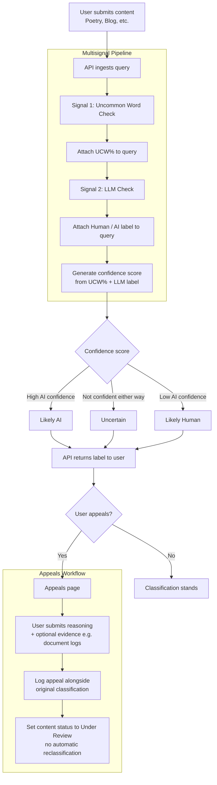

## Detection Signals

`Signal 1` - For one of the signals I implemented a dictionary of words that are uncommon for human usage when writing but common in AI writing. I implemented a function to take the use of these uncommon words and divide them by the total use count of the passage. After a threshold of 3% it would be more common to be AI. This is just a working threshold for now, UCW only accounts for 25% of the total labeling so it doesn't push the needle that far. However in the future after more testing I may change it to a higher threshold if human writing is frequently caught as AI by the UCW signal
`Signal 2` - The second signal  LLM classification signal to label responses based on whether it reads as AI or not. It labels content as either human or AI and gives a confidence score of that rating. This way you are not getting blind labels and you can see how confident the model was in given that label: "Human", Confidence score: ".90."
 `Cofidence Score` - The confidence score is created from taking the label and the score from the first signal and combining them to create a confidence score. First we weight the signals with the Model signal being weighed at 75% and the UCW being weighed at 25% we then normalize the uncommon-word signal. After that we take the sum of both signals as the confidence.

 {
    "confidence": 0.24,
    "content_id": "30a22284-dd68-4f14-8890-06896233e3d4",
    "creator_id": "test-user-1",
    "label": "Likely Human",
    "signals": {
        "llm": {
            "available": true,
            "confidence": 0.68,
            "label": "Human"
        },
        "ucw": {
            "above_threshold": false,
            "matched_words": [],
            "total_words": 29,
            "ucw_percent": 0.0,
            "uncommon_count": 0
        }
    }
}

{                                                                                                                                                        
    "confidence": 0.7375,
    "content_id": "72467782-5bed-4217-852c-4d58a3416313",
    "creator_id": "test-user-1",
    "label": "Likely AI",
    "signals": {
        "llm": {
            "available": true,
            "confidence": 0.65,
            "label": "AI"
        },
        "ucw": {
            "above_threshold": true,
            "matched_words": [
                "delve",
                "fostering",
                "holistic",
                "intricate",
                "pivotal",
                "realm",
                "seamless",
                "tapestry",
                "testament",
                "underscores",
                "vibrant"
            ],
            "total_words": 32,
            "ucw_percent": 0.3438,
            "uncommon_count": 11
        }
    }
}

## Uncertainty Representation
A confidence score of .6 percent is not high enough for me to label it likely AI, I labelled it as uncertain. Because it is likely for humans to use uncommon words in writing I weighed that lower than the other signal when producing the confidence score. UCW% is weighed at 25% while the Model prediction is weighed at 75%. One type of response that the model has trouble detecting is an AI generated response that has been edited lightly by a human. For example: "I've been thinking a lot about remote work lately. There are genuine tradeoffs — flexibility and no commute on one side, isolation and blurred work-life boundaries on the other. Studies show productivity varies widely by individual and role type." This response is still being detected as Human even though it was AI generated with a human touch added.

## Transparency label design
`Likely AI` - Label when there is a high AI confidence.

"reader_label": {
        "confidence_level": "Moderate",
        "confidence_text": "Our checks lean this way, but not strongly.",
        "disclaimer": "This is an automated estimate and can be wrong. If you created this content, you can appeal this label.",
        "headline": "This content was likely created with AI",
        "label": "Likely AI"
    },
`Uncertain` - Label when the score is not confident in either direction

    "reader_label": {
        "confidence_level": "Low",
        "confidence_text": "Our checks gave mixed results, so we aren't making a call either way.",
        "disclaimer": "This is an automated estimate and can be wrong. If you created this content, you can appeal this label.",
        "headline": "We can't tell if this was written by a person or by AI",
        "label": "Uncertain"
    },

`Likely Human` - Label when there is a low AI confidence score

"reader_label": {
        "confidence_level": "Moderate",
        "confidence_text": "Our checks lean this way, but not strongly.",
        "disclaimer": "This is an automated estimate and can be wrong. If you created this content, you can appeal this label.",
        "headline": "This content was likely created with AI",
        "label": "Likely AI"
    },

## Appeals workflow
The creator submits an appeal to contest a classification. Appeal may consist of the creators reasoning and evidence if they have any. The appeal is then logged alongside the original classification. The content is then updated to under review without given an automatic reclassification.

## Anticipated edge cases

Poetry often uses words that are uncommon in day to day speech but are used to create an atmosphere within the writing. However, a system that flags uncommon words may incorrectly flag poetry as AI.

The same could be said for song lyrics. Songs have varying structures and could be labeled as AI because the LLM thinks it has strange syntactically and does not come of as normal human writing.

## Architecture Narrative

User queries API with content (Poetry, Blog, Etc). The user query is ingested and subjected to the first check of the multisignal pipeline, the uncommon word check. The UCW% is then attached to the query and sent to the second layer in the pipeline, the LLM check. The LLM parses the content and returns whether or not it reads as human or AI text. That label is then also attached to the query. Using the two signals a confidence score is then generated and depending on the score the query is labeled: Likely AI, Uncertain, or Likely Human. The API then returns the label to the user.
When a user appeals a classification they are taken to an appeals page where they give their reasoning for the appeal and any evidence if they have it (working document logs, etc). The appeal is then logged alongside the original classification. The content is then updated to under review without given an automatic reclassification.

## Spec Reflection

The specs I wrote in planning.md really helped guide my design especially with implementing the first endpoints and signals. By giving claude my workflow diagram and my signal designs I was able to generate code that matched my vision. One way it diverged from my plan was the problem decomposition it did. I was not expecting it to create so many different files for this problem, so much so that I had to tell it to stop decomposing the problem when unnecessary.

## AI Usage
1. I asked it to use lines 10-14 which correlated to my labels section in planning.md to create a label generation function that maps confidence scores to the correct label text. It reused a function it used in scoring.py to do this. It did this because I revised the prompt telling the model it was doing too much problem decomposition and to stop doing so going forward.
2. I told it to use the detection signals portion as well as lines 29-57 to create the post/submit endpoint/. It then created the endpoint first with hardcoded responses then I told it to wire in the actual signal detection once the pipeline was completed.

## DEMO

https://screenrec.com/share/hgiAB4pCcy

`auditlog of appeal`- {"timestamp": "2026-10-03T16:49:43.563749+00:00", "content_id": "2f7d529b-c2b2-4520-ab03-370dd4477efc", "creator_reasoning": "I wrote this myself from personal experience. I am a non-native English speaker, and my writing style may appear more formal than typical.", "evidence": null, "original_classification": {"timestamp": "2026-10-03T16:46:43.524606+00:00", "content_id": "2f7d529b-c2b2-4520-ab03-370dd4477efc", "creator_id": "test-user-1", "attribution": "Likely Human", "confidence": 0.3375, "signal_1_ucw_percent": 0.0, "signal_2_llm_label": "Human", "signal_2_llm_confidence": 0.55}, "status": "Under Review"}