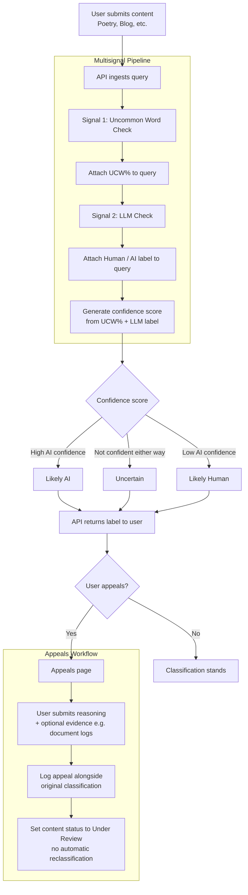

## Detection Signals

`Signal 1` - For one of the signals I would implement a dictionary of words that are uncommon for human usage when writing but common in AI writing. I plan to take the use of these uncommon words and divide them by the total use count of the passage. After a certain threshold it would be more common to be AI. I would probably have to experiment with the threshold to capture AI writing without catching too many human responses on accident. 
`Signal 2` - The second signal would be a LLM classification signal to label responses based on whether it reads as AI or not. We can use an AI probability score. ex:ai_probability: 0.8
 `Cofidence Score` - I would combine taking the label and the score from the first label to create a confidence score. Normalize the uncommon-word signal, Convert the LLM result to a score Then combine them

## Uncertainty Representation
A confidence score of .6 percent is not high enough for me to label it most likely AI I would most likely label it as uncertain. To get the scores themselves I would take the uncommon word (UCW) percentage and match it with its corresponding label given by the LLM. If something has a high UCW% but is labelled as human text I would give it a confidence score leaning toward it being a human because it is possible for a human to write a text that use a high percent of uncommon words. If something has a low UCW% but is labeled as AI text I would lean it towards being AI because it is common for people to edit generated responses with words that seem more natural

## Transparency label design
`Likely AI` - Label when there is a high AI confidence
`Uncertain` - Label when the score is not confident in either direction
`Likely Human` - Label when there is a low AI confidence score

## Appeals workflow
The creator submits an appeal to contest a classification. Appeal may consist of the creators reasoning and evidence if they have any. The appeal is then logged alongside the original classification. The content is then updated to under review without given an automatic reclassification.

## Anticipated edge cases

Poetry often uses words that are uncommon in day to day speech but are used to create an atmosphere within the writing. However, a system that flags uncommon words may incorrectly flag poetry as AI.

The same could be said for song lyrics. Songs have varying structures and could be labeled as AI because the LLM thinks it has strange syntactically and does not come of as normal human writing.

## Architecture Narrative

User queries API with content (Poetry, Blog, Etc). The user query is ingested and subjected to the first check of the multisignal pipeline, the uncommon word check. The UCW% is then attached to the query and sent to the second layer in the pipeline, the LLM check. The LLM parses the content and returns whether or not it reads as human or AI text. That label is then also attached to the query. Using the two signals a confidence score is then generated and depending on the score the query is labeled: Likely AI, Uncertain, or Likely Human. The API then returns the label to the user.
When a user appeals a classification they are taken to an appeals page where they give their reasoning for the appeal and any evidence if they have it (working document logs, etc). The appeal is then logged alongside the original classification. The content is then updated to under review without given an automatic reclassification.

## AI Tool Plan

`M3` - For milestone 3 I plan to provide my detection signals as well as the workflow diagram so that claude has an idea of what the overall project will look like.
After that I'll ask it to implement the submission endpoint and the UCW% signal. For each signal I will ask it to create some test

`M4` - For milestone 4 I plan to feed claude the design for the uncertainity representation as well as the second signal, the LLM detection, from there I will ask it to come up with different ways to combine the different signals to produce a confidence score. I will go through its response and pick the best option.

`M5` - For milestone 5 I will give claude my label variants, and appeals workflow and ask it to build out the final piece of the workflow as well as the UI.